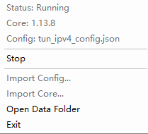

# SingTray

语言：[English](README.md) | [中文](README_CN.md)

SingTray 是一个 Windows 托盘程序，用来控制 `sing-box`。

它通过 Windows Service 运行 `sing-box`，托盘菜单负责启动、停止、导入和查看状态。

## 快速开始

1. 安装 SingTray。
2. 从开始菜单启动 `SingTray`。
3. 右键托盘图标。
4. 使用 `Import Core...` 导入 `sing-box` 内核 zip。
5. 使用 `Import Config...` 导入你的 JSON 配置文件。
6. 点击 `Start` 启动。

`sing-box` 官方地址：

```text
https://github.com/SagerNet/sing-box
```

## 托盘菜单



Status：

- `Running`：sing-box 正在运行
- `Stopped`：sing-box 已停止
- `Starting`：正在启动
- `Stopping`：正在停止
- `Error`：启动或运行失败
- `Unavailable`：托盘无法连接 service

Core：

- 版本号：内核可用
- `Missing`：未导入内核
- `Error`：内核校验失败
- `Ready`：内核存在，但版本文本不可用

Config：

- 文件名：配置可用
- `Unconfigured`：未导入配置
- `Waiting`：内核缺失或不可用
- `Error`：配置校验失败

## 导入规则

- sing-box 运行、启动、停止时不能导入。
- 导入配置会保留原文件名。
- 菜单显示的配置名和实际保存的配置文件名一致。
- 导入结束后会清理 `tmp\imports` 临时文件。
- 导入 Core 或 Config 不会自动启动或重启 sing-box。

## 日志

日志目录：

```text
C:\ProgramData\SingTray\logs\
```

文件：

- `app.log`：SingTray service 自身事件
- `singbox.log`：sing-box 原始 stdout/stderr 输出

规则：

- `app.log` 在 service 启动时重建。
- `singbox.log` 在 sing-box 启动时重建。
- `singbox.log` 保留 sing-box 原始日志行，不额外添加 SingTray 时间戳。
- sing-box 日志会缓冲写入，每 30 秒刷新一次。
- sing-box 停止或退出时会立即刷新日志。

## 数据目录

默认数据目录：

```text
C:\ProgramData\SingTray\
```

结构：

```text
C:\ProgramData\SingTray\
  core\
    sing-box.exe
  configs\
    <导入的配置文件名>.json
  logs\
    app.log
    singbox.log
  state\
    state.json
  tmp\
    imports\
```

托盘菜单点击 `Open Data Folder` 可以打开该目录。

## 安装内容

默认安装目录：

```text
C:\Program Files\SingTray\
```

安装后：

- `SingTray.Service` 作为 Windows Service 运行。
- `SingTray.Client` 作为托盘程序运行。
- service 随 Windows 启动。
- 托盘程序随用户登录启动。

## 编译

编译解决方案：

```powershell
dotnet build SingTray.sln
```

构建安装包：

```powershell
.\Installer\build-release.ps1 -Version v0.1.0 -Mode self-contained
.\Installer\build-release.ps1 -Version v0.1.0 -Mode framework
```

安装包输出：

```text
Installer\output\
```

## 许可证

MIT License，详见 [LICENSE](LICENSE)。
